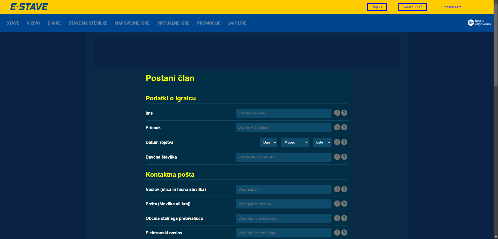

# E-Stave Website Registration Page

This repository showcases the design and structure of a registration form for the **E-Stave** website. The form collects detailed user information, ensuring compliance with data collection regulations.

## Table of Contents
- [Overview](#overview)
- [Features](#features)
- [Technologies Used](#technologies-used)
- [Screenshots](#screenshots)
- [How to Use](#how-to-use)
- [License](#license)

## Overview
The registration form is designed for users to sign up and provide all necessary personal details required for participation in activities such as betting and gaming offered by the E-Stave platform. It includes fields for personal data, contact information, and account preferences.

## Features
- **Comprehensive User Information Collection**: Input fields for name, date of birth, address, and contact details.
- **Form Validation**: Ensures users provide complete and accurate information.
- **Security**: Includes fields for unique identifiers like tax numbers and document data, which are encrypted for security.
- **User Agreement Checkboxes**: Users confirm their data accuracy and agree to terms and conditions.

## Technologies Used
- **HTML5**: Markup structure of the form.
- **CSS3**: Styling for visual appeal and readability.
- **JavaScript**: Enhancements for form validation and interaction.

## Screenshots
Below are images illustrating the registration form and its layout:

### Personal Information Section


### Contact Information Section


### Account and Financial Details


## How to Use
1. **Clone the repository**:
   ```bash
   git clone https://github.com/username/e-stave-registration-form.git
   cd e-stave-registration-form
   ```

2. **Open the `index.html` file** in your browser to see the form in action.

3. **Submit form** data to your preferred backend service for handling user registration (a backend example script can be provided for integration).

## License
This project is licensed under the MIT License. See the [LICENSE](LICENSE) file for more information.
